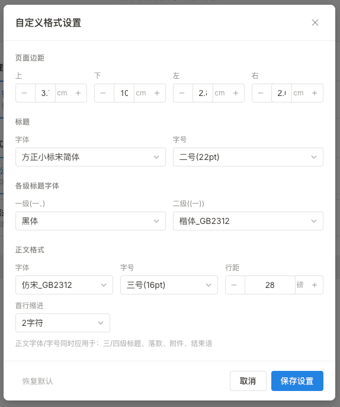

# 公文格式处理工具 Web 版

> 本项目基于 [docformat-gui](https://github.com/KaguraNanaga/docformat-gui) 二次改造，将原 Python + Tkinter 桌面应用重构为 React + TypeScript Web 应用。

一键修复 Word 文档格式，符合 GB/T 9704-2012 国家标准。纯浏览器本地处理，文件不上传服务器。

## 截图预览




## 功能特性

### 三种处理模式

| 模式 | 说明 |
|------|------|
| 智能处理 | 标点修复 + 格式排版，一步到位 |
| 标点修复 | 仅修复标点符号，保留原有格式 |
| 格式诊断 | 仅分析文档问题，不做修改 |

### 格式预设

- **公文格式** - GB/T 9704-2012 国家标准
- **学术论文** - 论文排版规范
- **法律文书** - 法律文书格式
- **自定义格式** - 支持自定义页边距、字体、字号、行距等参数

### 标点修复

- 英文标点自动转换为中文标点（括号、冒号、分号、问号、感叹号）
- 引号智能配对（直引号转弯引号）
- 省略号、破折号标准化
- 保护特殊格式（URL、邮箱、时间、文件路径等不被误转换）

### 格式排版

- 页边距设置
- 字体、字号设置
- 行距设置
- 首行缩进

## 技术栈

- **框架**: React 18 + TypeScript
- **构建**: Vite
- **文档处理**: JSZip（解析/生成 DOCX）
- **样式**: CSS（Notion 风格）

## 快速开始

### 安装依赖

```bash
npm install
```

### 开发模式

```bash
npm run dev
```

### 构建生产版本

```bash
npm run build
```

构建产物在 `dist/` 目录，可直接部署到任何静态网站托管服务。

## 在线体验

部署到 GitHub Pages / Vercel / Netlify 后即可在线使用。

## 限制说明

- **仅支持 .docx 格式**（不支持 .doc / .wps）
- 浏览器环境无法检测系统字体，设置的字体需要用户电脑已安装才能正确显示
- 复杂表格、图片等元素的格式处理可能不完善

## 与原项目的区别

| 特性 | 原项目 (Python) | Web 版 |
|------|----------------|--------|
| 运行环境 | 需安装 Python 或使用打包的 exe | 浏览器直接运行 |
| 支持格式 | .docx / .doc / .wps | 仅 .docx |
| 部署方式 | 本地安装 | 静态网站部署 |
| 跨平台 | 需分别打包 | 天然跨平台 |

## 致谢

- [docformat-gui](https://github.com/KaguraNanaga/docformat-gui) - 原始项目
- [JSZip](https://stuk.github.io/jszip/) - DOCX 文件处理
- [Notion](https://notion.so) - UI 设计灵感

## License

MIT
